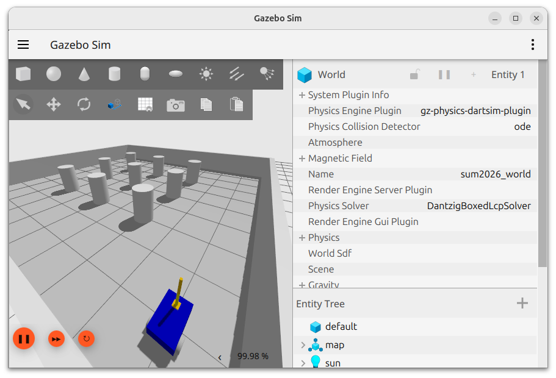

# summer-vacation-2026-ros2



## simulation

Gazeboを用いたシミュレーションです。

```bash
ros2 launch sum2026_bringup sim.launch.xml
```

```bash
ros2 run teleop_twist_keyboard teleop_twist_keyboard --ros-args -r /cmd_vel:=/diff_drive_controller/cmd_vel -p stamped:=true
```

## real

未実装です。

```bash
ros2 launch sum2026_bringup real.launch.xml
```
